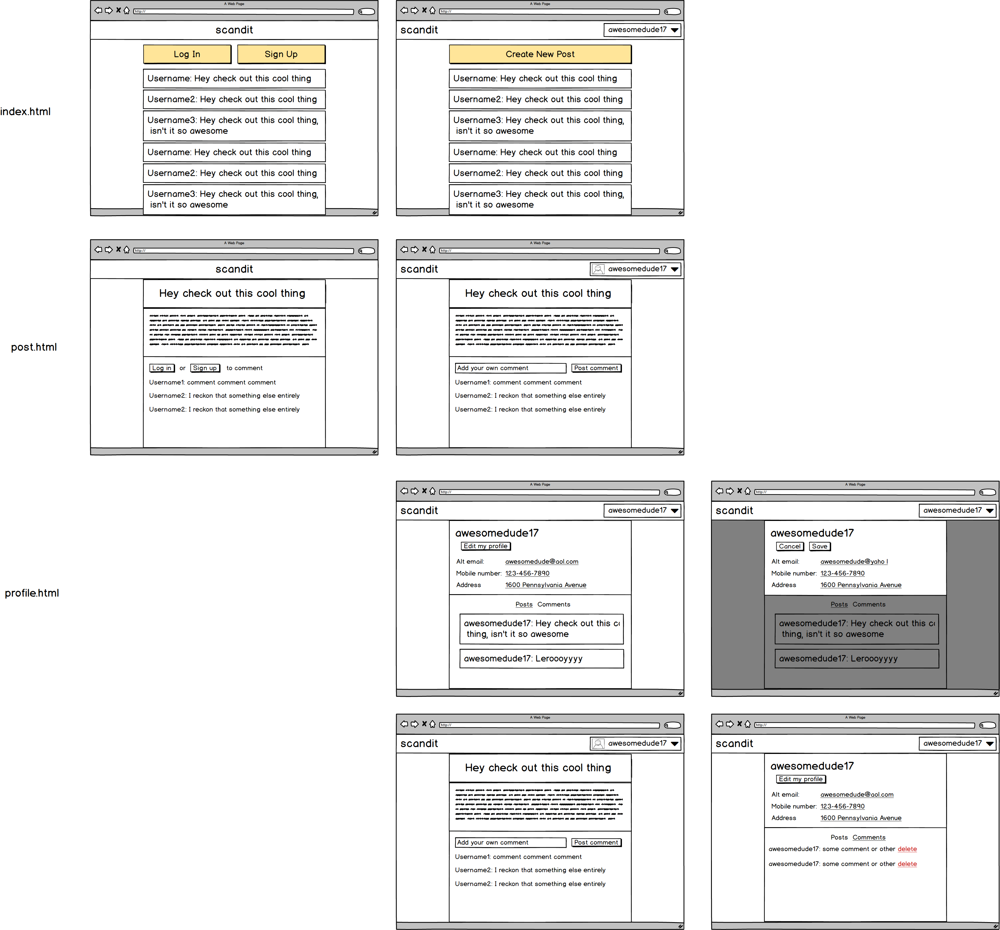

# Scanndit

**GA Project 1 - Readme**

**Project Members: Davis Allen, Phil Lee**

---

**Explanations of the technologies used.**

>Technologies Used: JavaScript, HTML, CSS, Bootstrap. Our focus on this project was to primarily focus on vanilla JS and familiarize ourselves with API calls.

**A couple of paragraphs about the general approach you took.**

> We started this project with a focus on modulaization and DRY principle. We took a pair programming and individual approach. Initially we started off by buidling the general template layout and file structure of the project together, then divided up the work based on user stories. In order to keep us working together we tackled different user stories from the same feature. This allowed us to work independently on a story but also forced us to have frequent meetings where we shared, discussed, and refactored our code into reusable components.

**Descriptions of any unsolved problems or major hurdles you had to overcome.**

> We've come across various bugs as we were navigating around our websites but we were able to troubleshoot. The major problem we faced was around maintaining the state of the user

**A link to your planning documentation for how you broke down this project with deliverables and timelines.**

> Refer to the pivotal-tracker for a list of all the features we have built. We used pivotal-tracker to assign tasks to each individual and to mark as complete.

**Installation instructions for any dependencies.**

**A link to your user stories — who your users are, what they want, and why.**

> Our user base is your average everyday person who seeks a platform to express their highly important and valued opinion and thoughts. In this day and age, a user is typically busy and do not have the time to learn how to use a product. Therefore, we approached our web app with a minimialist mindset and kept everything as simple and intutive to use without any prior knowledge.

**A link to your wireframes — sketches of major views or interfaces in your application.**

> Note: This is our original wire frame and our final design has changed slighthly.

